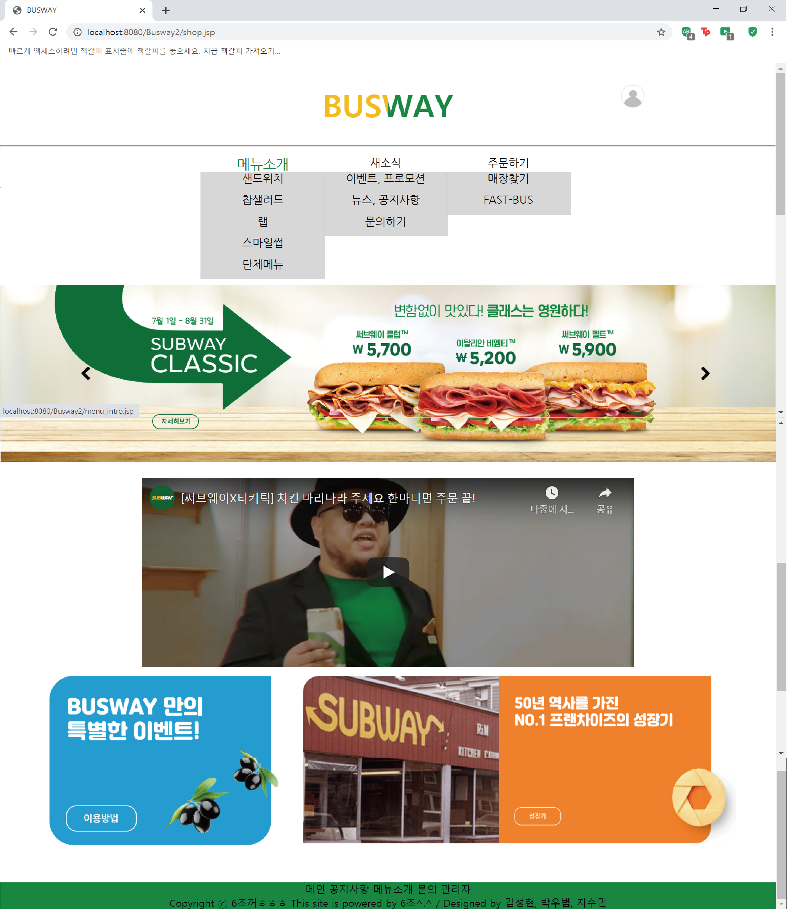
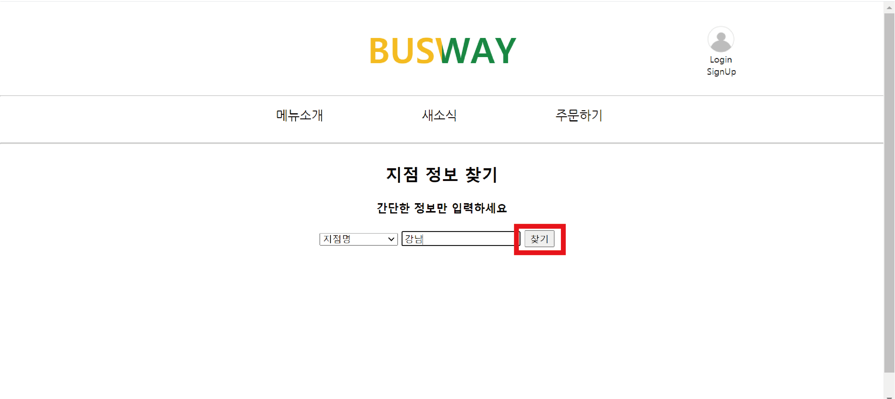
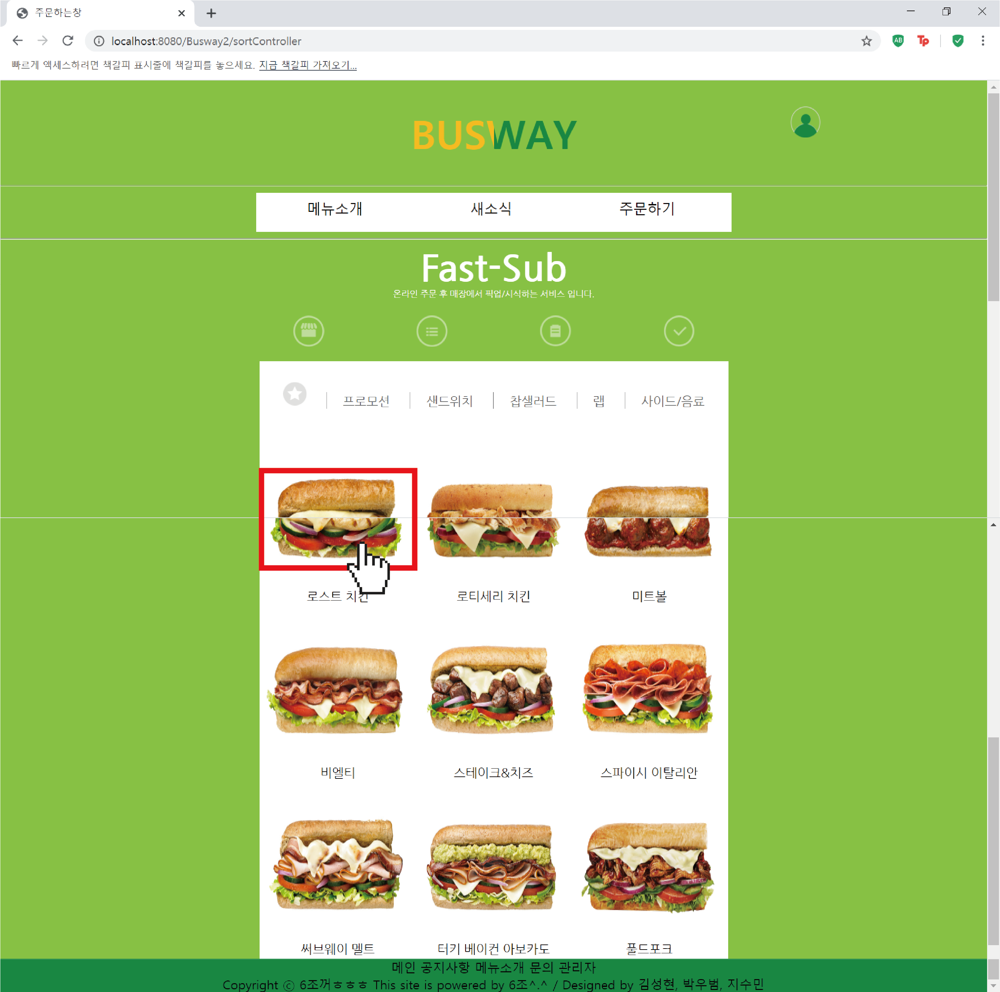
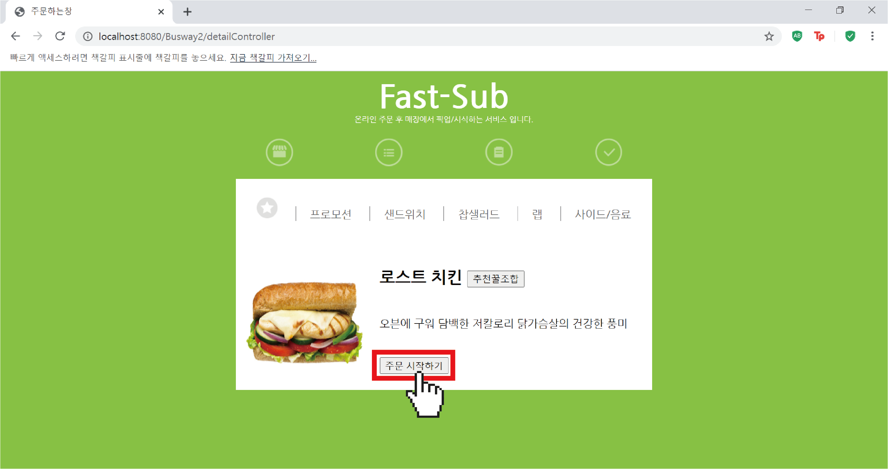
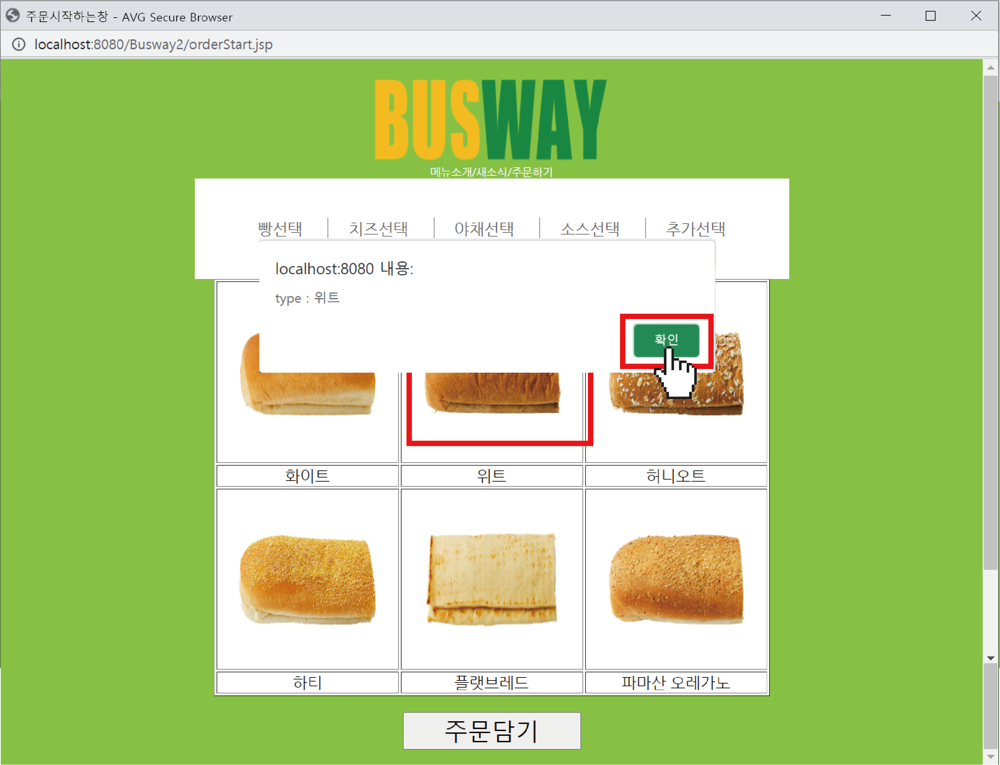
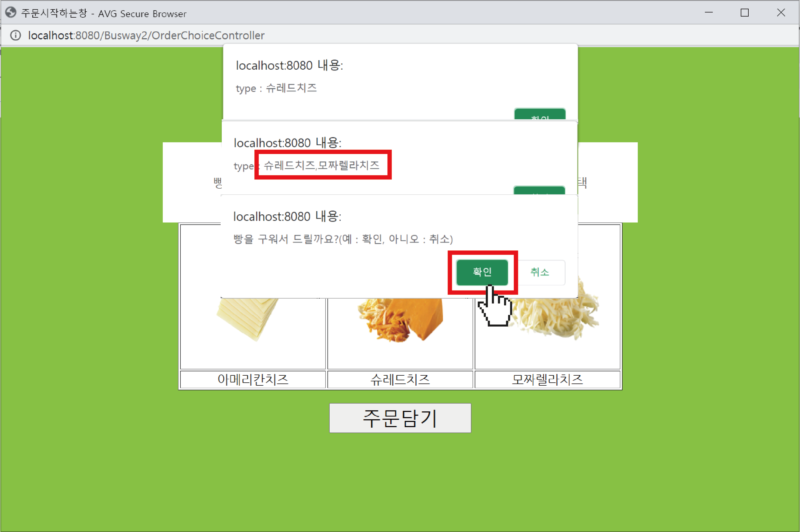
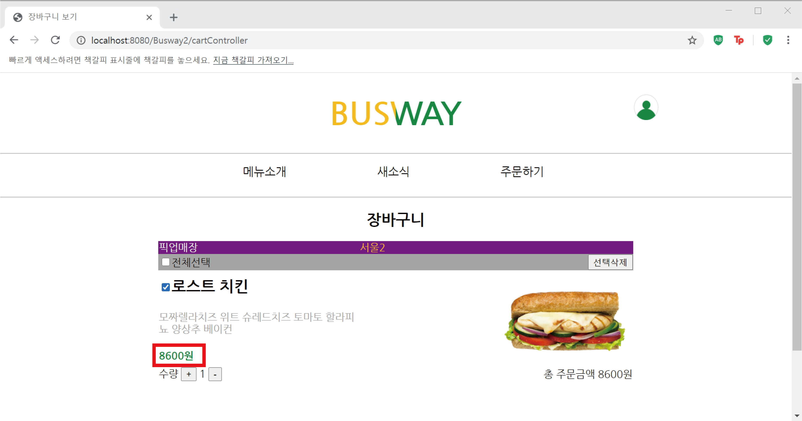

# semi

*Busway*

세미 프로젝트로 진행한 버스웨이 프로젝트 입니다. 
서브웨이를 모티브로 하여 제작한 이 사이트는 실제 상품의 상세정보를 알고 토핑 선택, 주문 및 포인트 적립, 고객의 리뷰남기기 가능합니다.
저는 이 프로젝트에서 상품의 상세페이지 및 장바구니 부분을 맡았습니다.

[main] 버스웨이 메인 홈페이지 입니다.
메뉴소개/새소식/주문하기 탭에 마우스를 올리면 자동으로 하위메뉴가 내려오는 효과를 주었습니다.
주문하기를 클릭하여 매장찾기 화면으로 이동합니다.

 [지점 정보 찾기] 주문하고 싶은 지점명을 찾습니다.

여러종류의 상품을 한눈에 볼 수 있는 상품소개 화면 입니다.
 

 

[주문과정] 빵의 종류를 고르는 것을 시작으로 다른 토핑을 고릅니다.

 

치즈,야채,소스,추가선택 등은 다수선택이 가능하여 복수선택을 할시 나중에 선택한 토핑이 차례로 뒤에 붙는것을 안내창에서 확인할 수 있습니다.
빵의 굽기여부와 크기선택을 마지막으로 다음화면으로 이동합니다.

[장바구니] 주문한 음식을 확인할 수 있는 장바구니 화면입니다. 수량에 따라 변하는 최종금액을 확인하고 주문을 마칩니다.
 

